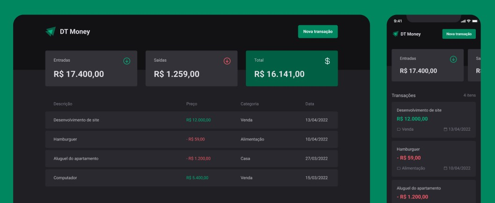

<p align="center">
 
</p>

<p align="center">Simple finance tracking app made with reactjs to learn the basics of consuming an API. This project was developed during Rocketseat's React courses.</p>



## Project Setup

```sh
npm install
```

### Compile and Hot-Reload for Development

#### To run the frontend:

```sh
npm run dev
```

#### To run the json api:

```sh
npm run dev:server
```

### Type-Check, Compile and Minify for Production

```sh
npm run build
```
